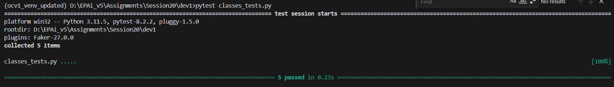
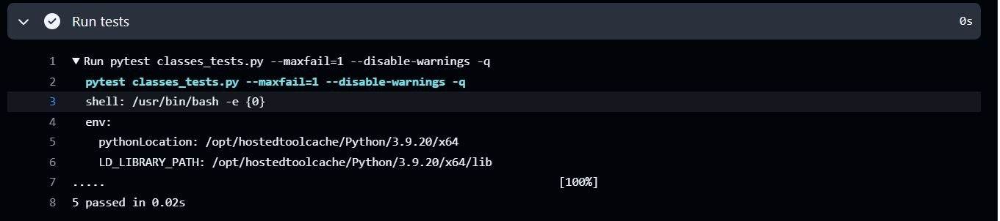

# EPAiV5-Session20 - Python Classes Implementation


## Overview
The Python script demonstrates a modular and object-oriented design to solve real-world problems using classes. It includes the following main components:

**1. Person Class:** Represents individuals with attributes such as full name, year of birth, age, and salary details. It features methods for salary calculation and dynamic updates.

**2. Circle Class:** Models geometric properties of a circle, including radius, diameter, and area, with caching for efficiency.

**3. Vehicle and ElectricVehicle Classes:** Provide a structure for generic and electric vehicles with classification capabilities.

**4. ValidatedAttribute Class:** A descriptor-based utility for validating attributes to ensure they are positive numbers.

**5. DynamicClass:** Demonstrates dynamic attribute management using Python's `setattr`.

## Features and Functionalities

### 1. Person Class
The `Person` class encapsulates personal information and includes methods for dynamic property updates. Key features:

- **Attributes:** First name, last name, year of birth, base salary, and bonus percentage.
- **Dynamic Properties:**
  - `age`: Computes the age based on the current year and birth year.
full_name: Combines first and last names into a single attribute.
  - `salary`: Calculates the total salary, including bonus.
- **Validation:**
  - Ensures the year of birth is an integer.
  - Validates that the bonus percentage is between 0 and 100.

#### Example Usage:

```
person = Person(first_name="John", last_name="Doe", birth_year=1990)
person.set_salary(50000, 20)  # Base salary: $50,000, Bonus: 20%
print(person.salary)  # Output: $60,000

```

### 2. Circle Class
The Circle class models a circle with:

- **Attributes:**
  - `radius`: The radius of the circle.
  - `diameter`: Computed as twice the radius.
  - `area`: Computed lazily using - 𝜋 × radius^2

- **Validation:**
  - Ensures the radius is a positive number.

#### Example Usage:

```
circle = Circle(radius=10)
print(circle.area)  # Output: 314.159 (approx.)
circle.diameter = 20  # Adjusts radius to 10

```

### 3. Vehicle and ElectricVehicle Classes
These classes provide a blueprint for modeling vehicles with distinct properties and classification methods:

- **Vehicle Class:**
  - **Attributes:** Manufacturer, model, and year.
  - **Class-level counter** to track the number of vehicles instantiated.
  - **Static method** to classify a vehicle type (e.g., car, truck).

- **ElectricVehicle Class:**
  - Inherits from `Vehicle`.
  - Overrides the classification method to denote electric vehicles.

#### Example Usage:


```
vehicle = Vehicle("Toyota", "Camry", 2020)
ev = ElectricVehicle("Tesla", "Model S", 2022)
print(Vehicle.get_vehicle_count())  # Output: 2
print(ev.classify_vehicle("car"))  # Output: "This is an electric car"

```

### 4. ValidatedAttribute Class
A utility class for managing numeric attributes with validation:

- Ensures the value is numeric and greater than zero.
- Provides encapsulation and data validation for critical attributes.

#### Example Usage:


```
validated = ValidatedAttribute()
validated.value = 10
print(validated.value)  # Output: 10

```

### 5. DynamicClass
This class demonstrates how to dynamically set and manage attributes at runtime using Python’s `setattr`.

#### Example Usage:

```
dynamic = DynamicClass()
dynamic.dynamic_attr("new_attr", "Dynamic Value")
print(dynamic.new_attr)  # Output: "Dynamic Value"

```


## Installation and Dependencies
This code is implemented in Python 3. It uses only the built-in libraries (`datetime`, `math`, and `typing`), so no external dependencies are required.

## Testing
This repo includes unit tests to validate its functionality. To run the tests, use:

```
pytest classes_tests.py

```

## Test Resuts

#### Local PC Test Execution



#### Workflow Actions



## Code Design Principles
- **Encapsulation:** Sensitive attributes are protected with `_` prefixes and managed through getter/setter methods or properties.
- **Inheritance:** The `ElectricVehicle` class extends the `Vehicle` class, demonstrating polymorphism.
- **Validation:** Robust checks ensure data integrity across attributes.
- **Lazy Evaluation:** The `Circle` class uses lazy evaluation to compute the area only when required, optimizing performance.

## Applications
This codebase serves as a foundation for:

- **Human Resources Management:** Manage employee details, calculate salaries, and validate inputs.
- **Geometric Computations:** Perform efficient calculations for geometric shapes like circles.
- **Vehicle Inventory Systems:** Track vehicle details and classify vehicle types dynamically.
- **Attribute Management:** Dynamically create and validate attributes for dynamic programming needs.

## Limitations and Future Enhancements
- **Person Class:**
  - Expand validation for names to include special characters.
  - Add methods to handle complex salary structures (e.g., deductions).
- **Circle Class:**
  - Extend functionality to compute circumference.
- **Vehicle Classes:**
  - Introduce fuel economy calculations for hybrid vehicles.
- **DynamicClass:**
  - Add type checking for dynamically added attributes.

## Conclusion
This implementation demonstrates Python's capabilities in object-oriented programming and dynamic attribute management. It combines practical applications with efficient validation mechanisms to ensure data integrity and reusability.

---------------------------------------------------------------------------------------------------------------------------------------------------

**Submission by** - Hema Aparna M

**mail id** - mhema.aprai@gmail.com

---------------------------------------------------------------------------------------------------------------------------------------------------
